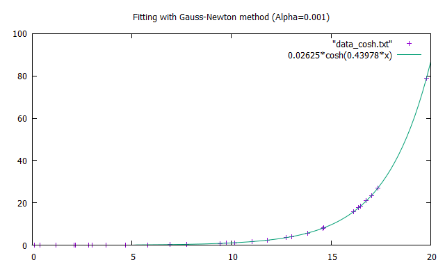
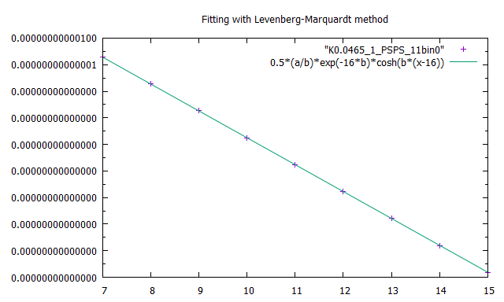

# LeastSquare
Fortranで最小二乗法を用いて生データからフィッティングを行うアルゴリズムを実装しました。  
線形関数でのフィッティングは比較的簡単にできますが、非線形関数でのフィッティングは微分をする際にチェインルールにより外に変数が出てきてしまうため、少し工夫が必要です。  
そのため、ガウス・ニュートン法およびレーベンベルグ・マルカート法というアルゴリズムを用いて最小二乗法を行う必要があります。  
レーベンベルグ・マルカート法は最小二乗法を解く上で非常に有力なアルゴリズムであり、ガウス・ニュートン法では上手く求まらない解でもダンピングファクタが良く効き、フィッティングを行えるアルゴリズムです。
ここで用いた最小二乗法という手法は統計学でも用いられ、生データから関数を特定することにより、その動向を調べることが出来るというメリットを持ちます。  
このことより、機械学習でもフィッティング法として最小二乗法が用いられています。  
以下にガウス・ニュートン法、レーベンベルグ・マルカート法によって解析したフィッティング関数及び生データの離散的データのプロットを示します。

ガウス・ニュートン法  
  
  
レーベンベルグ・マルカート法  
  